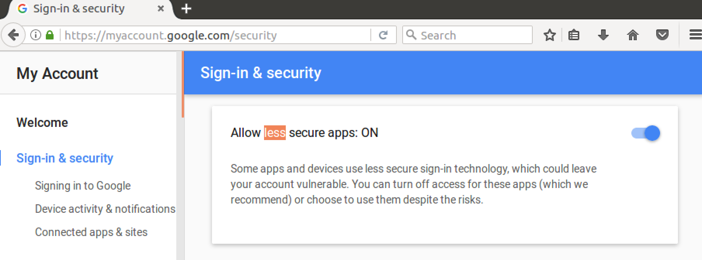

# DeviseSample

1. Install the related gems: 

	```Gemfile```
	```Ruby
	gem 'haml'
	gem 'haml-rails'
	gem 'mysql2'
	gem 'devise'
	```
	```bundle install```


2. Generate devise objects
	```Ruby
	$ rails generate devise:install
	```
	Gives following output:
	```Ruby
	Running via Spring preloader in process 5627
			create  config/initializers/devise.rb
			create  config/locales/devise.en.yml
	===============================================================================

	Some setup you must do manually if you haven't yet:

	1. Ensure you have defined default url options in your environments files. Here
		is an example of default_url_options appropriate for a development environment
		in config/environments/development.rb:

			config.action_mailer.default_url_options = { host: 'localhost', port: 3000 }

		In production, :host should be set to the actual host of your application.

	2. Ensure you have defined root_url to *something* in your config/routes.rb.
		For example:

			root to: "home#index"

	3. Ensure you have flash messages in app/views/layouts/application.html.erb.
		For example:

			<p class="notice"><%= notice %></p>
			<p class="alert"><%= alert %></p>

	4. You can copy Devise views (for customization) to your app by running:

			rails g devise:views

	===============================================================================

	```

	Briefly above statements say those:
	1. You have to arrange default_url_options in production enviroment
	2. In order to route to somewhere after successful login you myst have a "root_url"
	3. In order to display devise messages, ensure your views have "notice" and "alert" flash messages.
	4. You can use devise templates by running command ```rails g devise:views```


3. Go to ```config/environments/development.rb``` and set the mailer configurations. Possible configurations can be like:
	```Ruby
	# Devise related configuration
	...
	config.action_mailer.raise_delivery_errors = true
	...
	config.action_mailer.default_url_options = { host: 'localhost', port: 3000 }
	config.action_mailer.delivery_method = :smtp
	config.action_mailer.smtp_settings = {
		address: “smtp.gmail.com”,
		port: 587,
		domain: ENV[MOCMON_MAIL_DOMAIN],
		authentication: “plain”,
		enable_starttls_auto: true,
		user_name: ENV[“MOCMON_MAIL_USERNAME”],
		password: ENV[“MOCMON_MAIL_PASSWORD”]
	}
	```
	Set following parameter in ```config/initializers/devise.rb``` in order to set the from field of mails:
	```Ruby
	config.mailer_sender = 'mocmon.automailsender.NOREPLY@gmail.com'
	```
	For gmail specific cases, set allow less secure parameters flag from security settings:
	
	*Similarly for production ```config/environments/production.rb``` should be modified!*
4. Run following command to generate the ```User``` model. 
	```Ruby
	rails generate devise User
	```
	This command also automatically adds following line to ```config/routes.rb```:
	```Ruby
	devise_for :users
	```

5. The generated model is as follows. Here you can add/remove Devise's modules (abilities). For the definition of these abilities refer to http://devise.plataformatec.com.br/. I suggest to add at least ```:confirmable```.
	```Ruby
	class User < ApplicationRecord
		# Include default devise modules. Others available are:
		# :confirmable, :lockable, :timeoutable and :omniauthable
		devise :database_authenticatable, :registerable,
				:recoverable, :rememberable, :trackable, :validatable
	end
	```
	The migration file will be as follows. If you add / remove any modules from above model, you need to uncomment / comment related field from the migration module: 
	```Ruby
	class DeviseCreateUsers < ActiveRecord::Migration[5.0]
		def change
			create_table :users do |t|
				## Database authenticatable
				t.string :email,              null: false, default: ""
				t.string :encrypted_password, null: false, default: ""

				## Recoverable
				t.string   :reset_password_token
				t.datetime :reset_password_sent_at

				## Rememberable
				t.datetime :remember_created_at

				## Trackable
				t.integer  :sign_in_count, default: 0, null: false
				t.datetime :current_sign_in_at
				t.datetime :last_sign_in_at
				t.string   :current_sign_in_ip
				t.string   :last_sign_in_ip

				## Confirmable
				# t.string   :confirmation_token
				# t.datetime :confirmed_at
				# t.datetime :confirmation_sent_at
				# t.string   :unconfirmed_email # Only if using reconfirmable

				## Lockable
				# t.integer  :failed_attempts, default: 0, null: false # Only if lock strategy is :failed_attempts
				# t.string   :unlock_token # Only if unlock strategy is :email or :both
				# t.datetime :locked_at


				t.timestamps null: false
			end

			add_index :users, :email,                unique: true
			add_index :users, :reset_password_token, unique: true
			# add_index :users, :confirmation_token,   unique: true
			# add_index :users, :unlock_token,         unique: true
		end
	end
	```
	Generate your DB schema that will hold Devise data:
	```SQL
	create database DeviseSampleDB;
	```
	Configure ```config/database.yml``` for related connection info to your database. Below is an example for how we used:
	```Ruby
	default: &default
		adapter: mysql2
		encoding: utf8
		pool: 5
		socket: /var/run/mysqld/mysqld.sock

	development:
		<<: *default
		username: <%= ENV['MOCMON_DATABASE_USERNAME'] %>
		password: <%= ENV['MOCMON_DATABASE_PASSWORD'] %>
		database: DeviseSampleDB

	# Warning: The database defined as "test" will be erased and
	# re-generated from your development database when you run "rake".
	# Do not set this db to the same as development or production.
	test:
		<<: *default

	production:
		<<: *default
	```
	Finally run
	```Ruby
	rake db:migrate
	```
	This command will generate following table in your database:
	```SQL
	mysql> desc users;
	+------------------------+--------------+------+-----+---------+----------------+
	| Field                  | Type         | Null | Key | Default | Extra          |
	+------------------------+--------------+------+-----+---------+----------------+
	| id                     | int(11)      | NO   | PRI | NULL    | auto_increment |
	| email                  | varchar(255) | NO   | UNI |         |                |
	| encrypted_password     | varchar(255) | NO   |     |         |                |
	| reset_password_token   | varchar(255) | YES  | UNI | NULL    |                |
	| reset_password_sent_at | datetime     | YES  |     | NULL    |                |
	| remember_created_at    | datetime     | YES  |     | NULL    |                |
	| sign_in_count          | int(11)      | NO   |     | 0       |                |
	| current_sign_in_at     | datetime     | YES  |     | NULL    |                |
	| last_sign_in_at        | datetime     | YES  |     | NULL    |                |
	| current_sign_in_ip     | varchar(255) | YES  |     | NULL    |                |
	| last_sign_in_ip        | varchar(255) | YES  |     | NULL    |                |
	| confirmation_token     | varchar(255) | YES  |     | NULL    |                |
	| confirmed_at           | datetime     | YES  |     | NULL    |                |
	| confirmation_sent_at   | datetime     | YES  |     | NULL    |                |
	| unconfirmed_email      | varchar(255) | YES  |     | NULL    |                |
	| created_at             | datetime     | NO   |     | NULL    |                |
	| updated_at             | datetime     | NO   |     | NULL    |                |
	+------------------------+--------------+------+-----+---------+----------------+
	17 rows in set (0,00 sec)
	```
	Arrange the root directory that will be used after succesfull login:
	- Generate the controller that will handle successful login. (At this point you can also use your existing controllers or generate a scaffold as well):
	```Ruby
	rails g controller home
	```
	- Generate a route named ```root``` which will be automaticall used after successfull login:
	```config/routes.rb```:
	```Ruby
	root to: 'home#index'
	```
	```Ruby
	rake routes
	```
	```
	root GET    /                                 home#index
	```
	
6. Now we are ready to use following helper methods that Devise had generated within our controller files:
	- We can place following call to any place that we want to protect by user authentication. A good place is ApplicationController since it is inherited by all controller classes.
	```Ruby
	protect_from_forgery with: :exception, prepend: true
	before_action :authenticate_user!
	```
	- You can also use following helpers in your controller files (remember, the text "user" comes from prepared model name, if you use some other name it is changed accordingly):
	```Ruby
	user_signed_in?
	current_user
	user_session
	```
	- 